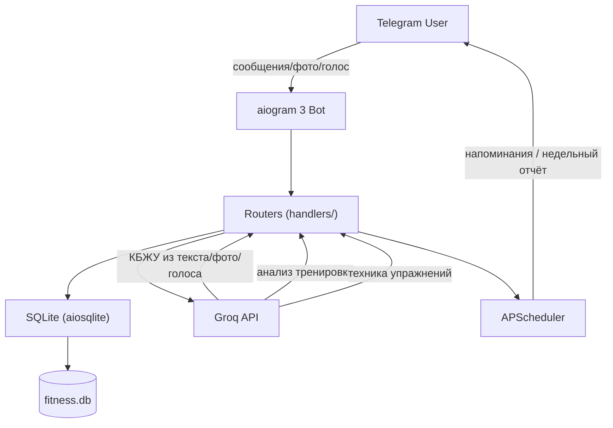

# Fitness Bot — @stat_sila_bot — Design Document

## Overview

Telegram-бот для персонального трекинга силовых тренировок и питания с AI-анализом.
Целевая аудитория — атлеты, тренирующиеся по блоковой периодизации.
Ключевая идея: минимум ручного ввода, максимум автоматического анализа через Groq AI.

Stack: Python 3.12 · aiogram 3 · aiosqlite · APScheduler · Groq API · matplotlib

---

## Architecture



Бот работает как systemd-сервис (`fitness-bot.service`), один процесс, in-memory FSM.

---

## Components and Interfaces

### handlers/

| Файл | Ответственность |
|---|---|
| `main_menu.py` | /start, главное меню, роутинг |
| `onboarding.py` | FSM онбординг, 8 шагов |
| `workout.py` | тренировки, подходы, таймер, прогрессия |
| `nutrition.py` | питание, шаблоны, текст/голос/фото |
| `stats.py` | статистика, графики matplotlib |
| `settings.py` | настройки, напоминания |
| `edit.py` | редактирование записей питания и тренировок |
| `nav.py` | send_nav, track_msg — единый стиль навигации |

### services/

| Файл | Ответственность |
|---|---|
| `ai_service.py` | Groq: parse_food, parse_food_photo, analyze_workout, get_exercise_technique, transcribe_voice |
| `scheduler.py` | APScheduler: напоминания о питании (5/день), недельный отчёт (вс 20:00) |

### database/db.py

Единая точка доступа к SQLite. Все запросы — async через aiosqlite.

---

## Data Models

```
users
  user_id, name, age, height, weight, goal, experience,
  days_per_week, equipment, injuries,
  goal_calories, goal_protein, goal_carbs, goal_fat,
  current_week, current_week_type, current_day_index,
  utc_offset, onboarded

user_program
  user_id, week_type, day_type, order_num,
  exercise, sets, reps_range, weight, rpe_range, rest

workouts
  user_id, date, day_type, week_type, week_number,
  total_tonnage, avg_rpe, is_finished, ex_index, set_index

workout_sets
  workout_id, exercise, set_number,
  planned_weight, actual_weight, reps, rpe, notes

food_log
  user_id, date, description, calories, protein, carbs, fat, created_at

food_templates
  user_id, name, description, calories, protein, carbs, fat

meal_reminders
  user_id, meal_id, enabled, hour, minute

```

---

## Key Features

### Тренировки
- Блоковая периодизация: strength → volume → deload
- Персональная программа для Кирилла (hardcoded) или AI-генерация для других
- FSM логирование: формат `80x5 RPE8`, таблица подходов в реальном времени
- Таймер отдыха с обратным отсчётом и уведомлением за 10 сек
- Автопрогрессия: RPE ≤ 8 → +2.5кг, RPE 8–9 → держим, RPE > 9 → -2.5кг
- AI-анализ после завершения (сравнение с прошлой аналогичной тренировкой)

### Питание
- Ввод: текст / голос (Whisper) / фото (llama-4-scout vision)
- AI возвращает структурированный список продуктов с калориями каждого
- Шаблоны: сохрани приём → повторяй одной кнопкой
- КБЖУ цели с прогресс-барами

### Статистика
- Сводка на сегодня (питание + тренировка)
- Личные рекорды по упражнениям
- Графики прогресса весов (matplotlib, топ-6 упражнений, последние 15 сессий)
- Недельный отчёт автоматически в воскресенье

### Напоминания
- 5 приёмов пищи, гибкое время, включение/выключение каждого
- Не беспокоит если еда уже записана за последние 30 мин

---

## AI Models (Groq)

| Задача | Модель |
|---|---|
| Парсинг еды из текста | llama-3.3-70b-versatile |
| Анализ фото еды | meta-llama/llama-4-scout-17b-16e-instruct |
| Транскрипция голоса | whisper-large-v3-turbo |
| Анализ тренировки | llama-3.3-70b-versatile |
| Техника упражнений | llama-3.3-70b-versatile |

---

## Error Handling

- AI-ответы: retry с упрощённым запросом при парсинг-ошибке
- Нулевые КБЖУ от AI → запись не сохраняется, пользователь получает сообщение об ошибке
- Telegram API ошибки (message can't be edited и т.п.) — перехватываются через `try/except`
- Systemd следит за процессом, перезапускает при падении

---

## Testing Strategy

Сейчас автотестов нет. Тестирование ручное через реальный бот.

Рекомендуемые точки для покрытия:
- `parse_set_input()` — парсинг форматов ввода подходов
- `_calculate_progression()` — логика прогрессии весов
- `_build_charts()` — генерация графиков
- DB-функции — интеграционные тесты с in-memory SQLite

---

## What's Done / What's Next

Реализовано:
- [x] Онбординг, AI-программа, логирование тренировок
- [x] Трекинг питания текст/голос/фото
- [x] Автопрогрессия весов
- [x] Графики прогресса
- [x] Шаблоны питания
- [x] Гибкие напоминания
- [x] Недельный отчёт

В планах:
- [ ] /reset — сброс цикла программы
- [ ] Корректировка КБЖУ после записи
- [ ] Трекинг воды
