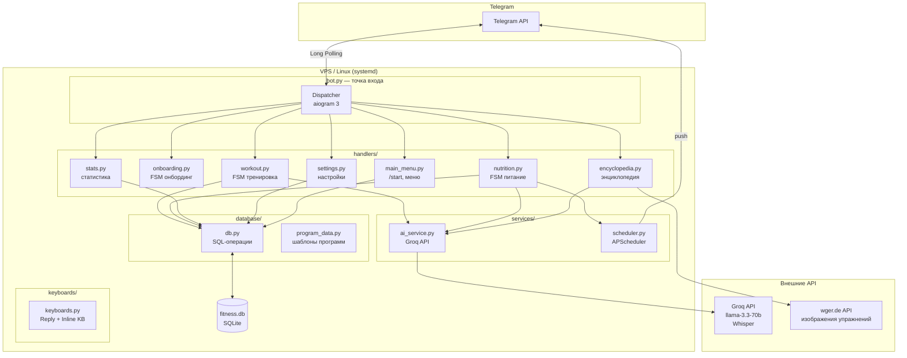
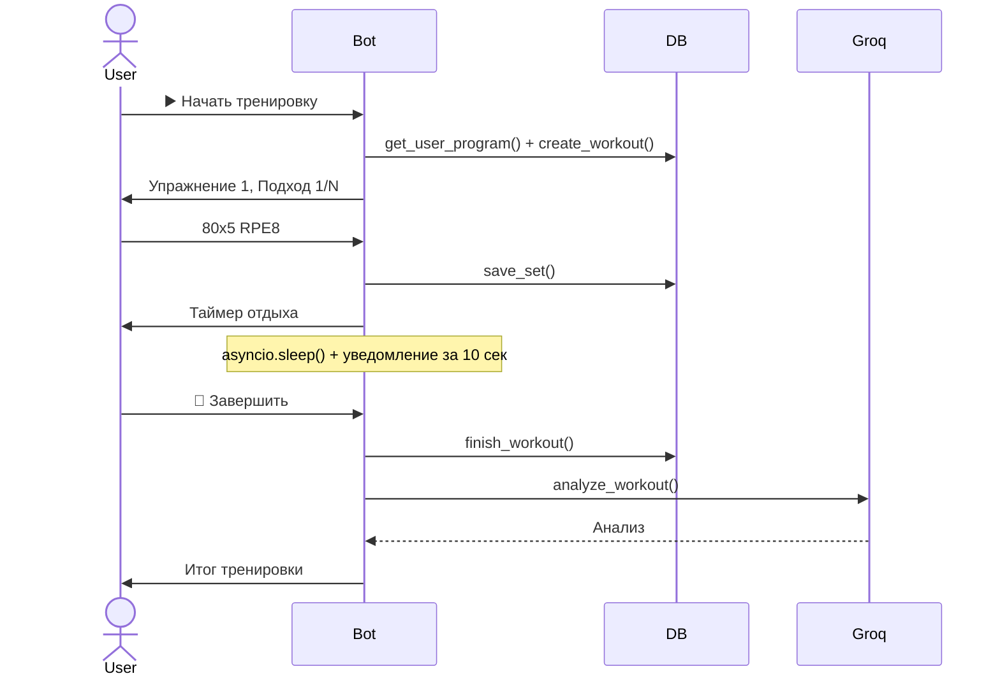
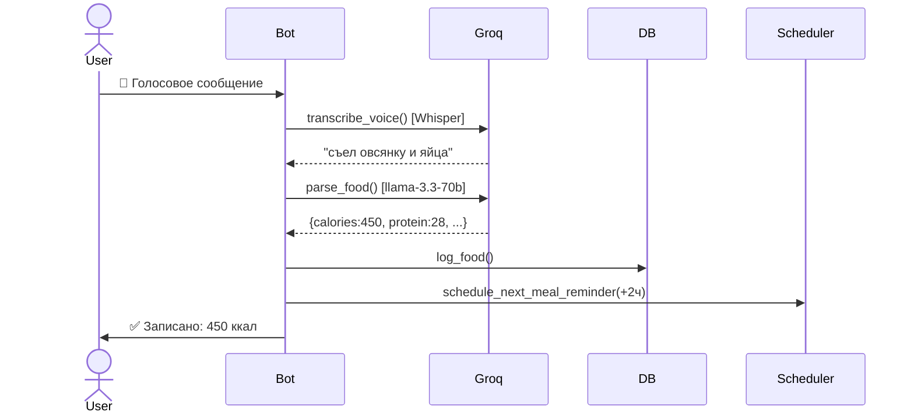
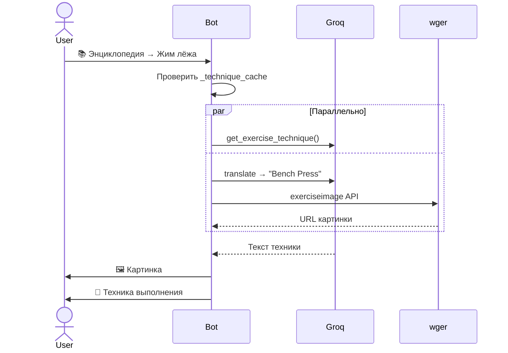
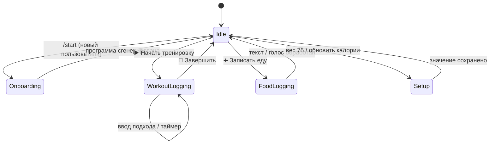

# Архитектурная документация — Fitness Bot

**Версия:** 1.0  
**Дата:** 2026-05-30

---

## 1. Обзор системы

Fitness Bot — асинхронный Telegram-бот на Python. Построен по принципу **роутер-хендлер**: каждый модуль `handlers/` отвечает за свою функциональную область и регистрирует независимый `aiogram.Router`. Вся бизнес-логика разделена на слои: хендлеры → сервисы → база данных.

---

## 2. Компонентная схема



---

## 3. Описание компонентов

### 3.1 bot.py — точка входа
- Инициализирует `Bot` и `Dispatcher`
- Регистрирует все роутеры в приоритетном порядке
- Запускает `APScheduler`
- Устанавливает команды бота через `set_my_commands`
- Управляется через `systemd` (unit: `fitness-bot.service`)

### 3.2 handlers/

| Файл | Ответственность |
|------|----------------|
| `main_menu.py` | `/start`, главное меню, роутинг команд `/workout`, `/food`, `/summary`, `/stats`, `/settings` |
| `onboarding.py` | FSM-онбординг (8 шагов): сбор профиля, AI-генерация программы |
| `workout.py` | FSM-логирование подходов, таймер отдыха, завершение, AI-анализ |
| `nutrition.py` | Меню питания, FSM-ввод еды (текст/голос), детальный рацион |
| `stats.py` | Сводка дня, тоннаж за период, история питания |
| `settings.py` | Обновление веса и КБЖУ-целей |
| `encyclopedia.py` | Каталог упражнений по группам мышц (inline navigation) |
| `nav.py` | Хелпер `send_nav()` — единый стиль навигационных сообщений |

### 3.3 services/

**ai_service.py** — все вызовы к Groq API:

| Функция | Модель | Назначение |
|---------|--------|-----------|
| `parse_food(text)` | llama-3.3-70b | Текст еды → КБЖУ |
| `get_nutrition_advice(totals, goals)` | llama-3.3-70b | Советы по питанию |
| `get_exercise_technique(exercise)` | llama-3.3-70b | Техника выполнения |
| `analyze_workout(current, previous, program)` | llama-3.3-70b | Анализ тренировки |
| `transcribe_voice(audio, filename)` | Whisper | Голос → текст |
| `generate_program(profile)` | llama-3.3-70b | Генерация программы |
| `get_exercise_gif(exercise)` | llama-3.3-70b + wger | Перевод + URL картинки |

**scheduler.py** — APScheduler (AsyncIOScheduler, timezone: Asia/Krasnoyarsk):
- Разовые задачи `date`-триггер
- `schedule_next_meal_reminder(user_id, delay=120min)` — напоминание о следующем приёме пищи

### 3.4 database/

**db.py** — все SQL-операции через `aiosqlite`. Паттерн: каждая функция открывает соединение, выполняет запрос, закрывает. Без ORM.

**program_data.py** — Python-словари с шаблонами тренировочных программ. Используются как fallback или база для AI-генерации.

### 3.5 keyboards/keyboards.py
Все клавиатуры проекта в одном файле:
- `main_menu()` — ReplyKeyboard главного меню (динамический ярлык тренировки)
- `nutrition_menu()` — ReplyKeyboard раздела питания
- `workout_menu()` — ReplyKeyboard раздела тренировок
- `workout_logging_keyboard()` — InlineKeyboard во время подхода
- `rest_timer_keyboard()` — InlineKeyboard выбора таймера отдыха
- `finish_keyboard()` — InlineKeyboard подтверждения завершения

---

## 4. Потоки данных

### 4.1 Запись тренировки



### 4.2 Запись питания (голос)



### 4.3 Просмотр техники (энциклопедия)



---

## 5. FSM-состояния



**Состояния:**

| StatesGroup | State | Описание |
|-------------|-------|---------|
| `WorkoutLogging` | `logging_sets` | Активная тренировка, ожидание ввода подхода |
| `FoodLogging` | `waiting_input` | Ожидание текста или голоса с едой |
| `Setup` | `waiting_weight` | Ожидание нового значения веса |
| `Setup` | `waiting_calories` | Ожидание нового значения калорий |
| `Onboarding` | `age … injuries` | 8 последовательных шагов сбора профиля |

---

## 6. Деплой

```
VPS (Ubuntu/Debian)
└── systemd unit: fitness-bot.service
    ├── User: oracle
    ├── WorkingDirectory: /home/oracle/fitness-bot
    ├── ExecStart: venv/bin/python bot.py
    ├── Restart: always / RestartSec: 5s
    └── Logs: bot.log (append)
```

**Управление:**
```bash
sudo systemctl restart fitness-bot   # перезапуск после изменений
sudo systemctl status fitness-bot    # статус
sudo systemctl stop fitness-bot      # остановка
tail -f /home/oracle/fitness-bot/bot.log  # логи в реальном времени
```

> ⚠️ Не запускать `nohup python bot.py` вручную — systemd создаст второй инстанс и возникнет TelegramConflictError.

---

## 7. Переменные окружения (.env)

| Переменная | Описание |
|-----------|---------|
| `BOT_TOKEN` | Telegram Bot API токен (@BotFather) |
| `GROQ_API_KEY` | API-ключ Groq Cloud |
