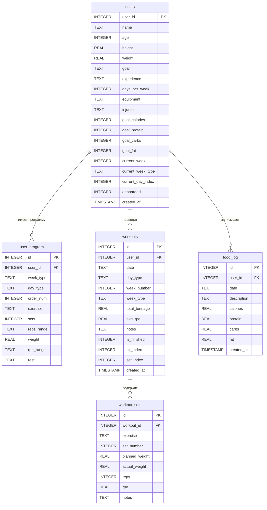

# Схема базы данных — Fitness Bot

**СУБД:** SQLite  
**Файл:** `fitness.db`  
**Дата:** 2026-05-30

---

## 1. ERD-диаграмма



---

## 2. Описание таблиц

### 2.1 `users` — профиль пользователя

| Поле | Тип | Описание |
|------|-----|---------|
| `user_id` | INTEGER PK | Telegram user_id |
| `name` | TEXT | Имя пользователя |
| `age` | INTEGER | Возраст |
| `height` | REAL | Рост, см |
| `weight` | REAL | Текущий вес, кг (обновляется) |
| `goal` | TEXT | Цель: `mass` / `cut` / `maintain` |
| `experience` | TEXT | Опыт: `beginner` / `intermediate` / `advanced` |
| `days_per_week` | INTEGER | Дней тренировок в неделю |
| `equipment` | TEXT | Оборудование: `gym` / `home` / `no_equipment` |
| `injuries` | TEXT | Травмы/ограничения (свободный текст) |
| `goal_calories` | INTEGER | Дневная норма калорий, ккал |
| `goal_protein` | INTEGER | Дневная норма белка, г |
| `goal_carbs` | INTEGER | Дневная норма углеводов, г |
| `goal_fat` | INTEGER | Дневная норма жиров, г |
| `current_week` | INTEGER | Номер текущей недели программы |
| `current_week_type` | TEXT | Тип недели: `strength` / `volume` / `deload` |
| `current_day_index` | INTEGER | Индекс текущего дня в рамках недели |
| `onboarded` | INTEGER | `1` — онбординг завершён |
| `created_at` | TIMESTAMP | Дата регистрации |

**Значения перечислений:**
```
goal:        mass | cut | maintain
experience:  beginner | intermediate | advanced
week_type:   strength | volume | deload
day_type:    upper_strength | upper_volume | legs
```

---

### 2.2 `user_program` — программа тренировок

Хранит все упражнения пользователя, разбитые по типу недели и типу дня.

| Поле | Тип | Описание |
|------|-----|---------|
| `id` | INTEGER PK | Автоинкремент |
| `user_id` | INTEGER FK | → `users.user_id` |
| `week_type` | TEXT | Тип недели: `strength` / `volume` / `deload` |
| `day_type` | TEXT | Тип дня: `upper_strength` / `upper_volume` / `legs` |
| `order_num` | INTEGER | Порядковый номер упражнения в тренировке |
| `exercise` | TEXT | Название упражнения (рус.) |
| `sets` | INTEGER | Количество подходов |
| `reps_range` | TEXT | Диапазон повторений, напр. `"6-8"` |
| `weight` | REAL | Рабочий вес, кг |
| `rpe_range` | TEXT | Целевой RPE, напр. `"8-9"` |
| `rest` | TEXT | Отдых между подходами, напр. `"2м30с"` |

> При пересборке программы (`/start`) все записи пользователя удаляются и создаются заново.

---

### 2.3 `workouts` — сессии тренировок

| Поле | Тип | Описание |
|------|-----|---------|
| `id` | INTEGER PK | Автоинкремент |
| `user_id` | INTEGER FK | → `users.user_id` |
| `date` | TEXT | Дата ISO: `"2026-05-30"` |
| `day_type` | TEXT | Тип тренировки (из программы) |
| `week_number` | INTEGER | Номер недели программы |
| `week_type` | TEXT | Тип недели |
| `total_tonnage` | REAL | Итоговый тоннаж, кг (Σ вес×повторения) |
| `avg_rpe` | REAL | Средний RPE по всем подходам |
| `notes` | TEXT | AI-анализ тренировки |
| `is_finished` | INTEGER | `0` — в процессе, `1` — завершена |
| `ex_index` | INTEGER | Индекс текущего упражнения (прогресс) |
| `set_index` | INTEGER | Индекс текущего подхода (прогресс) |
| `created_at` | TIMESTAMP | Дата и время начала |

> `ex_index` и `set_index` позволяют возобновить тренировку после обрыва сессии.

---

### 2.4 `workout_sets` — подходы

| Поле | Тип | Описание |
|------|-----|---------|
| `id` | INTEGER PK | Автоинкремент |
| `workout_id` | INTEGER FK | → `workouts.id` |
| `exercise` | TEXT | Название упражнения |
| `set_number` | INTEGER | Номер подхода в рамках упражнения |
| `planned_weight` | REAL | Плановый вес из программы, кг |
| `actual_weight` | REAL | Фактический вес, кг |
| `reps` | INTEGER | Количество повторений |
| `rpe` | REAL | RPE подхода (0–10) |
| `notes` | TEXT | Заметка к подходу |

**Формат ввода пользователя:** `80x5 RPE8` или `80x5`  
→ `actual_weight=80`, `reps=5`, `rpe=8.0`

---

### 2.5 `food_log` — приёмы пищи

| Поле | Тип | Описание |
|------|-----|---------|
| `id` | INTEGER PK | Автоинкремент |
| `user_id` | INTEGER FK | → `users.user_id` |
| `date` | TEXT | Дата ISO: `"2026-05-30"` |
| `description` | TEXT | Название приёма (AI-генерированное) |
| `calories` | REAL | Калории, ккал |
| `protein` | REAL | Белки, г |
| `carbs` | REAL | Углеводы, г |
| `fat` | REAL | Жиры, г |
| `created_at` | TIMESTAMP | Дата и время записи |

---

## 3. Ключевые SQL-запросы

### Сумма КБЖУ за день
```sql
SELECT SUM(calories), SUM(protein), SUM(carbs), SUM(fat)
FROM food_log
WHERE user_id = ? AND date = ?;
```

### Тоннаж за последние N тренировок
```sql
SELECT date, day_type, total_tonnage, avg_rpe
FROM workouts
WHERE user_id = ?
ORDER BY date DESC
LIMIT ?;
```

### Незавершённая тренировка (для возобновления)
```sql
SELECT * FROM workouts
WHERE user_id = ? AND is_finished = 0
ORDER BY created_at DESC
LIMIT 1;
```

### Последняя тренировка того же типа (для AI-сравнения)
```sql
SELECT * FROM workouts
WHERE user_id = ? AND day_type = ?
ORDER BY date DESC
LIMIT 1;
```

### Программа пользователя на конкретный день
```sql
SELECT * FROM user_program
WHERE user_id = ? AND week_type = ? AND day_type = ?
ORDER BY order_num;
```

---

## 4. Миграции

Миграции применяются в `init_db()` через блок `try/except`:
```python
for col, definition in [("age", "INTEGER"), ("height", "REAL"), ...]:
    try:
        await db.execute(f"ALTER TABLE users ADD COLUMN {col} {definition}")
    except Exception:
        pass  # Колонка уже существует
```

Это позволяет добавлять новые поля в существующую БД без потери данных.
